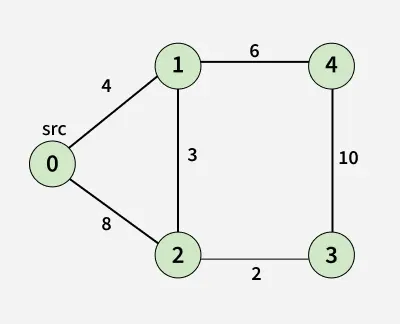

# Paths homework

## the homework

Implement dijkstra's algorithm in the file `src/dijkstra.rs` in the empty function `route(graph: &Graph, start: usize, end: usize) -> Some(Vec<usize>)` so that it returns the sequence of nodes between `start` and `end`, e.g. `Vec<start, 1, 2, ..., 99, end>`.

You can test if your code works by either running `cargo run` which calls the `route` function with real OSM map data, or `cargo test short_route` which will call it with a tiny 5-node graph. The test passes if you can return `Vec<0, 1, 2, 3>`.

The small graph:


## basic structure

`src/dijkstra.rs` is the file you will be working in, I've created a function called `route` that you should write your code in.

`src/lib.rs` is the main top-level file that defines this program. It's where `dijkstra.rs` is imported, and defines a couple of consts that are usable. It also includes one test that will call the `route` function above.

`src/main.rs` has the main function. Generally if a `lib.rs` file isn't included this serves the same purpose instead. It also includes the `main` entrypoint function. With the test I wrote this isn't necessarym but I've set this up so you can run your code more easily as you write it.

### other files you don't need to care too much about
`src/bin/build_graph.rs` is an executable to regenerate the graph data located at `data/prepared_graph.json`. Ignore this.

`src/graph.rs` and `src/graph` is where the code I wrote to generate and prepare the graph lives. You can largely ignore this for now, unless you're curious. Feel free to edit it if you need though.

## running it

### tests

`cargo test` runs all tests.
`cargo test graph` or `cargo test short_route` runs specific tests.
`cargo test --release` runs tests with release-compiled code, it executes faster but takes longer to compile.
`cargo test -- --no-capture` allows a test to print to the console (disabled by default).

`cargo run` runs the main function in `main.rs`.
`cargo run --release` as above, faster.
`cargo run --bin --release build_graph` runs the main function in `bin/build_graph.rs` which regenerates the graph json to `prepared_graph.json` from the raw OSM data in `small.json`.

## tips

The algorithm itself is very simple, the difficulty is in choosing which specific datastructures to use to track visited nodes and calculated distances.

You'll want to mostly be using `graph.neighbours(node_id)` to get all the edges connecting to a given node in each iteration. If you begin with `START` and call that function you'll get two edges, meaning this node connects to two other nodes. 

An Edge looks like this:

```rust
Edge {
    ends: [9441935581, 2099675083],
    weight: 5.326402878962706,
}
```

So if `current_node` is 9441935581 then in the next iteration we'll want to call `graph.neighbours(2099675083)` to see the next edges, and so on.
